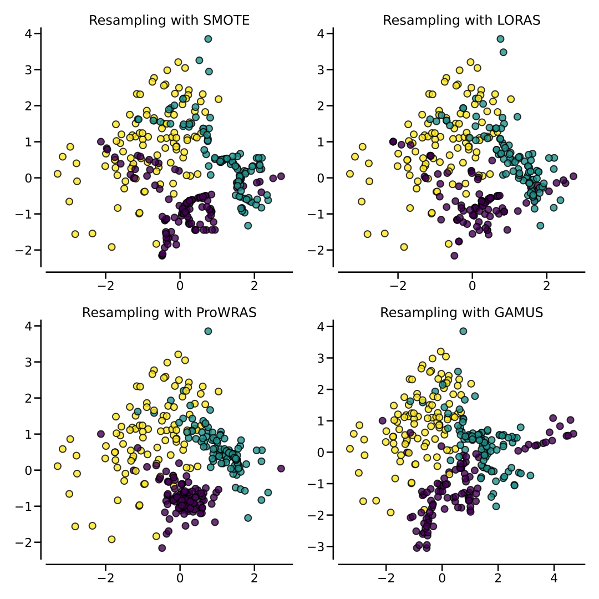
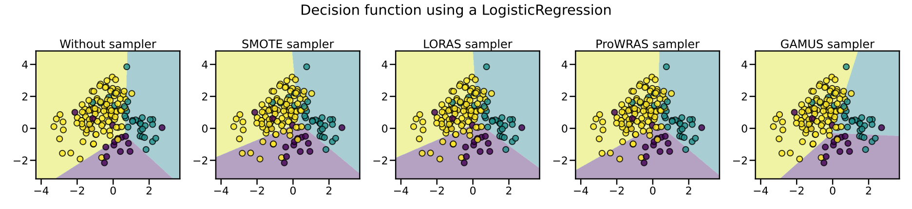

# LoRAS

[![CI][3]](https://github.com/zoj613/pyloras/actions/workflows/build-and-test.yml)
[![Codecov][4]](https://codecov.io/gh/zoj613/pyloras/)
[![PyPI][5]](https://pypi.org/project/pyloras/#history)

Localized Random Affine Shadowsampling

This repo provides a python implementation of an imbalanced dataset oversampling
technique known as Localized Random Affine Shadowsampling (LoRAS). It also provides
implementations of several other over/under-sampling algorithms not yet available in
the ``imbalanced-learn`` package. These implementations piggybacks off of ``imbalanced-learn``
and thus aim to be as compatible as possible with it.


## Dependencies
- `Python >= 3.8`
- `numpy >= 1.17.3`
- `imbalanced-learn < 1.0.0`


## Installation

Using `pip`:
```shell
$ pip install -U pyloras
```

Alternatively, one can install from source with the following shell commands:
```shell
$ git clone https://github.com/zoj613/pyloras.git
$ cd pyloras/
$ pip install .
```

## Usage

```python
from collections import Counter
from pyloras import LORAS
from sklearn.datasets import make_classification

X, y = make_classification(n_samples=20000, n_features=5, n_informative=5,
                           n_redundant=0, n_repeated=0, n_classes=3,
                           n_clusters_per_class=1,
                           weights=[0.01, 0.05, 0.94],
                           class_sep=0.8, random_state=0)

lrs = LORAS(random_state=0, manifold_learner_params={'perplexity': 35, 'n_iter': 250})
print(sorted(Counter(y).items()))
# [(0, 270), (1, 1056), (2, 18674)]
X_resampled, y_resampled = lrs.fit_resample(X, y)
print(sorted(Counter(y_resampled.astype(int)).items()))
# [(0, 18674), (1, 18674), (2, 18674)]

# one can also use any custom 2d manifold learner via the ``manifold_learner` parameter
from umap import UMAP
LORAS(manifold_learner=UMAP()).fit_resample(X, y)

```

## Visualization

Below is a comparision of `imbalanced-learn`'s `SMOTE` implementation with `LORAS`
on the dummy data used in [this doc page][2] using the default parameters.





The plots can be reproduced by running:
```
$ python scripts/compare_oversamplers.py --n_neighbors=<optional> --n_shadow=<optional> --n_affine=<optional>
```

## References
- Bej, S., Davtyan, N., Wolfien, M. et al. LoRAS: an oversampling approach for imbalanced datasets. Mach Learn 110, 279–301 (2021). https://doi.org/10.1007/s10994-020-05913-4
- Bej, S., Schultz, K., Srivastava, P., Wolfien, M., & Wolkenhauer, O. (2021). A multi-schematic classifier-independent oversampling approach for imbalanced datasets. ArXiv, abs/2107.07349.
- A. Tripathi, R. Chakraborty and S. K. Kopparapu, "A Novel Adaptive Minority Oversampling Technique for Improved Classification in Data Imbalanced Scenarios," 2020 25th International Conference on Pattern Recognition (ICPR), 2021, pp. 10650-10657, doi: 10.1109/ICPR48806.2021.9413002.


[1]: https://python-poetry.org/docs/pyproject/
[2]: https://imbalanced-learn.org/stable/auto_examples/over-sampling/plot_comparison_over_sampling.html#more-advanced-over-sampling-using-adasyn-and-smote
[3]: https://img.shields.io/github/workflow/status/zoj613/pyloras/CI/main?style=flat-square
[4]: https://img.shields.io/codecov/c/github/zoj613/pyloras?style=flat-square
[5]: https://img.shields.io/github/v/release/zoj613/pyloras?include_prereleases&style=flat-square
